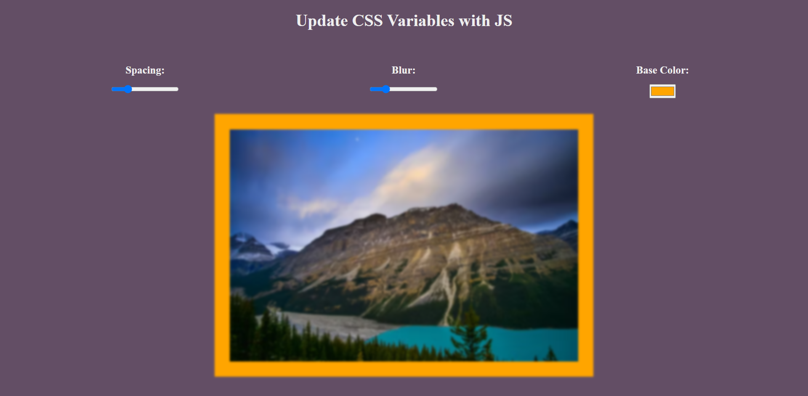

# [CSS Variables](https://rm-cssvariables.netlify.app/)

This app changes CSS variables via JavaScript.

## Usage

In this app you can give the spacing, blur and background of the image

## Technologies Used

This project was created using the following technologies:

- HTML
- CSS
- JavaScript
