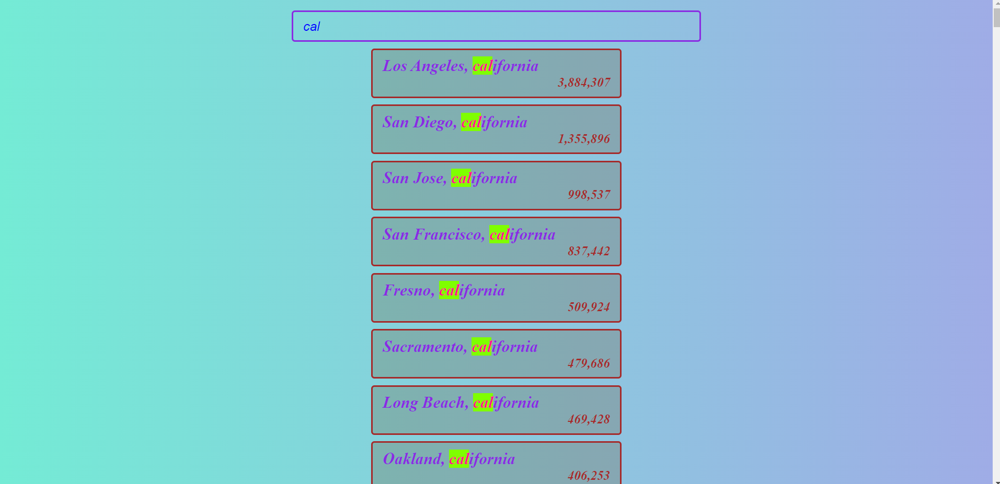

# [Ajax Type Ahead](https://rm-typeahead.netlify.app/)

It is a simple api app for searching cities and states in the United States. The app is created using the fetch function and regular expressions.

## Usage

1. Type the name of the city or state in the input field.
2. The list of the cities and states will be updated in real time.

## Technologies Used

This project was created using the following technologies:

- HTML
- CSS
- JavaScript
