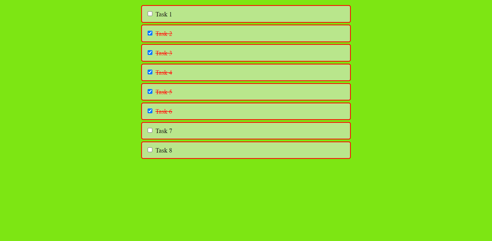

# [Hold Shift to Check Multiple Checkboxes](https://rm-shiftcheckboxes.netlify.app/)

This project is a beginner-friendly tutorial on using JavaScript to check multiple checkboxes by holding down the shift key.

## Technologies Used

This project was created using the following technologies:

- HTML
- CSS
- JavaScript
