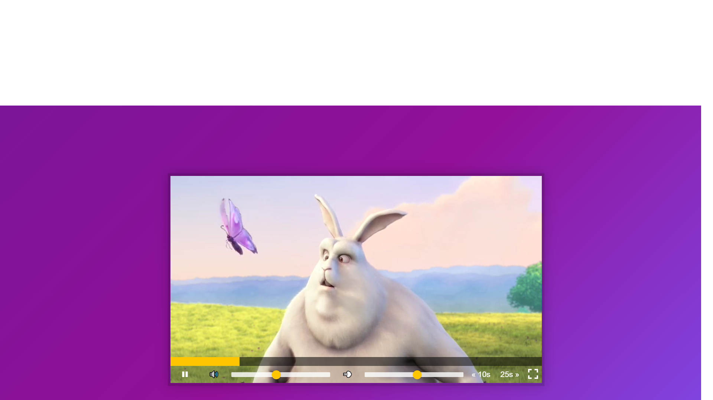

# [Custom HTML5 Video Player](https://rm-videoplayer.netlify.app/)

This is a custom HTML5 video player.

## Features

1. Play and pause the video
2. Change the volume
3. Change the playback speed
4. Skip forward and backward
5. Progress bar
6. Fullscreen

## Technologies Used

This project was created using the following technologies:

- HTML
- CSS
- JavaScript
