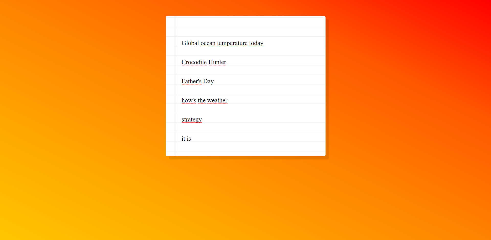

# [Speech Recognition](https://rm-speechrecognition.netlify.app/)

It is a simple speech recognition app that uses the browser's SpeechRecognition API to transcribe your voice into text.

## Technologies Used

This project was created using the following technologies:

- HTML
- CSS
- JavaScript
