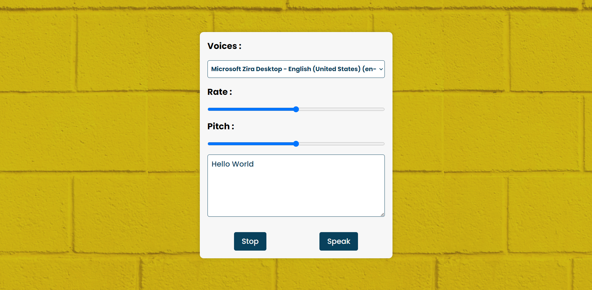

# [Speech Synthesis](https://rm-speechsynthesis.netlify.app/)

This project is a speech synthesis app that allows the user to type in text and have it read back to them. The user can also select a voice and change the rate and pitch of the speech.

## Usage

To use this app, simply type in the text you want to be read back to you and click the `speak` button. You can also select a voice from the dropdown menu and change the rate and pitch of the speech.

## Technologies Used

This project was created using the following technologies:

- HTML
- CSS
- JavaScript
