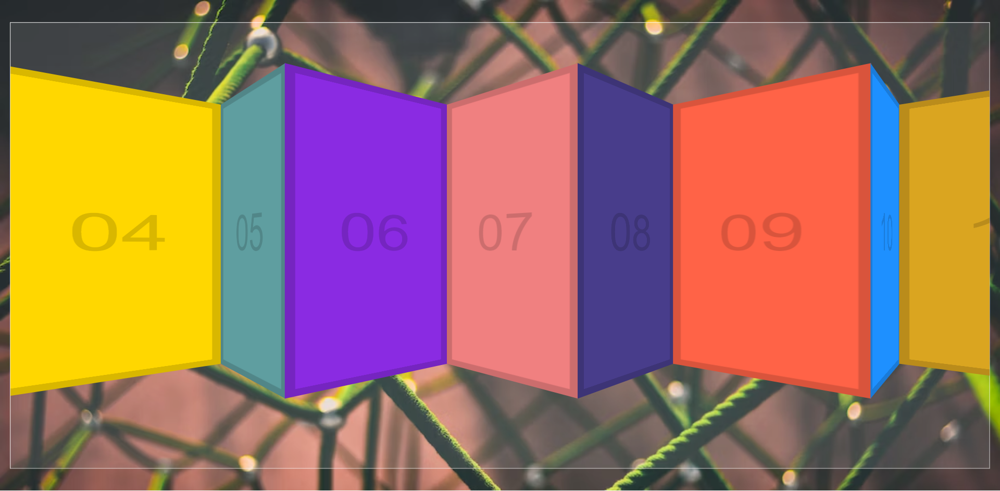

# [Click and Drug](https://rm-clickdrug.netlify.app/)

It is a simple app that allows you to click and drag a box around the screen. It is a good example of how to use the `mousedown`, `mouseup`, and `mousemove` events.

## Technologies Used

This project was created using the following technologies:

- HTML
- CSS
- JavaScript
