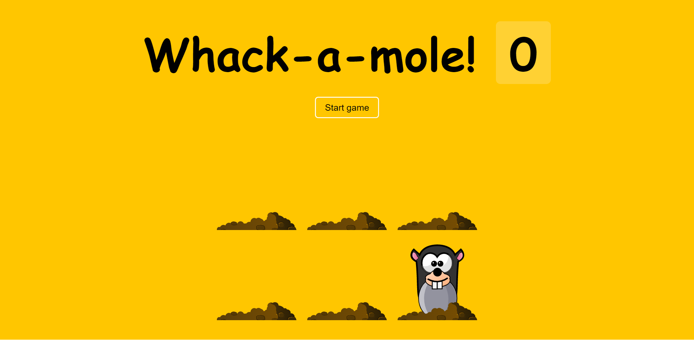

# [Whack A Mole](https://rm-whackamole.netlify.app/)

Whack A Mole is a simple game where the user has to click on the moles as they appear. The user has 10 seconds to click on as many moles as possible. The score is displayed at the end of the game.



## Usage

To run this project locally, you will need to clone the repository and open the `index.html` file in your browser.

```bash
git clone
cd whack-a-mole
```

## Technologies Used

This project was created using the following technologies:

- HTML
- CSS
- JavaScript
